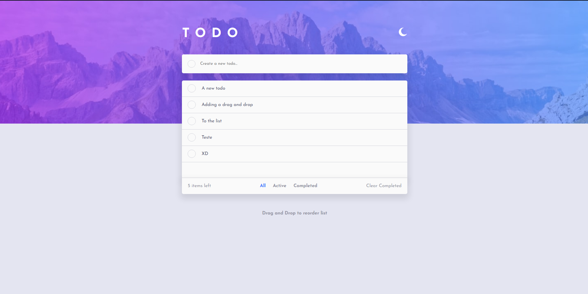
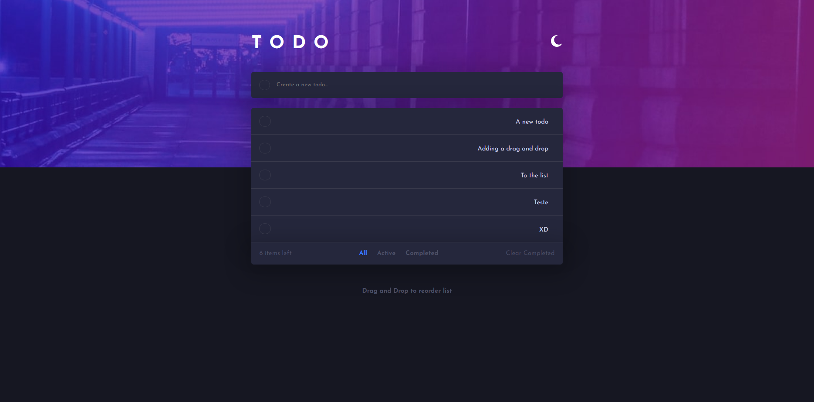

# Frontend Mentor - Todo app solution

- Essa é a minha solução para o desafio ["Todo app" do Frontend Mentor](https://www.frontendmentor.io/challenges/todo-app-Su1_KokOW).
  

## O objetivo do Desafio:
- O ojetivo do desafio é copiar o layout e fazer as funcionalidades do app com as imagens que o [desafio](https://www.frontendmentor.io/challenges/todo-app-Su1_KokOW) fornece.
 
 

## O usuário deve poder:

- Ver um bom layout do app dependendo o tamanho da tela do dispositivo
- Ver os "hover states" para todos os elementos interativos na página
- Adicionar novas tarefas na lista
- Marcar as tarefas como completos
- Deletar as tarefas da lista
- Filtrar por todas/ativas/completas as tarefas
- Limpar todas as tarefas completas
- Ativar o light/dark mode
- **Bonus**: Reordenar as tarefas com um "drag and drop"

  

# Screenshots:

 
  

# Links:
- Live Site URL: [https://guisegatto.github.io/todo-app-main/](https://guisegatto.github.io/todo-app-main/)
  

# O que quero melhorar nesse projeto:

- Utilizei `div` como primeiro filho de um `ul`
  - Preciso substituir essas `div` por `li`

- Refatorar o código deixando o mais organizado e legivel
